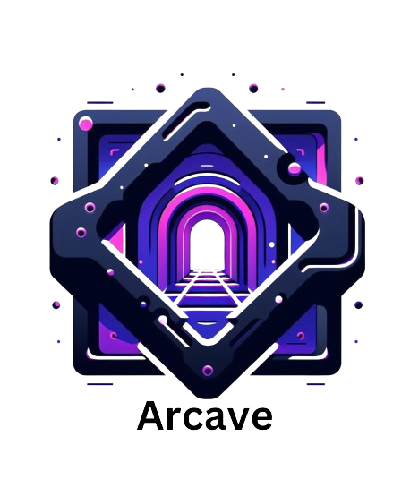
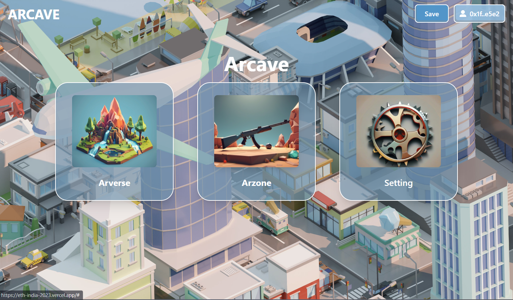
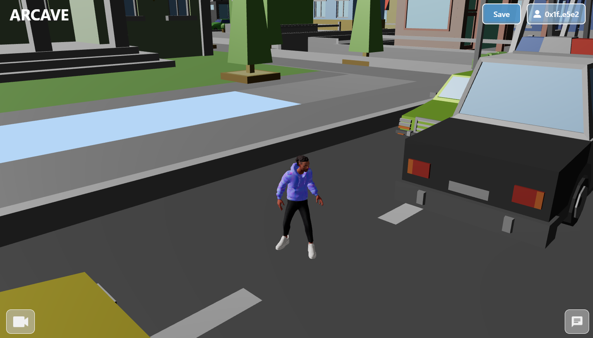
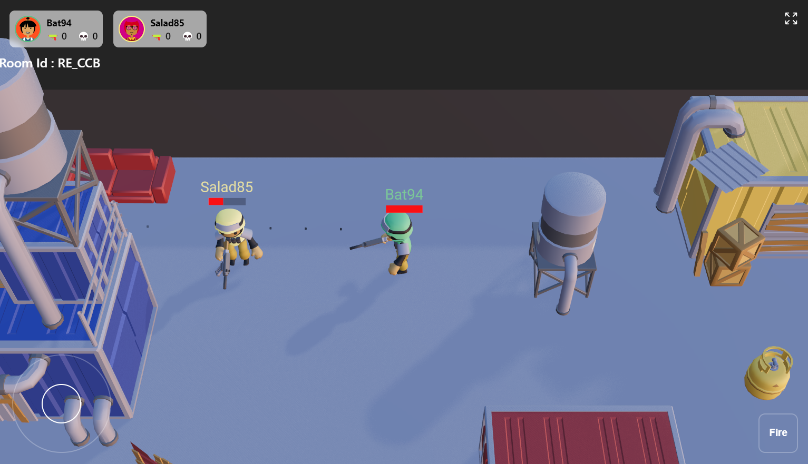
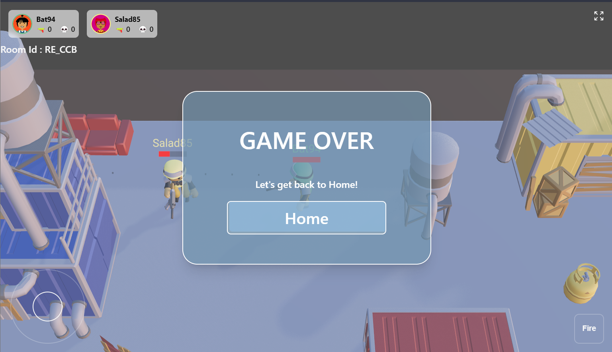

 

  

  <h3 align="center">Arcave</h3>

  

Step into an expansive open-world gaming metaverse on L2,  boasting low latency and scalable in-game communication with live audio and video.     
    <a href="https://github.com/startup-dreamer/Arcave-Contracts/blob/master/README.md"><strong>Explore the docs »</strong></a>
     
     
    <a href="https://eth-india-2023.vercel.app/">Try it out</a>
    ·
    <a href="https://github.com/startup-dreamer/Arcave-Contracts/issues">Report Bug</a>
    ·
    <a href="https://github.com/startup-dreamer/Arcave-Contracts/issues">Request Feature</a>
  

## Table of Contents
- [Introduction](#introduction)
- [Technolgies Used](#technolgies-used)
- [Built With](#built-with)
- [Screenshots](#demo-screenshots)
- [HotKeys](#hotkeys)
- [Todos](#todos)
- [Challenges](#challenges-we-ran-into)
- [Contributing](#contributing)
- [Challenges we ran into](#challenges-we-ran-into)
- [Contact](#contact)
- [Acknowledgments](#acknowledgments)

<!-- ABOUT THE PROJECT -->

## Introduction:
Arcave introduces the Arverse, a user-friendly metaverse addressing various challenges.
  
- ***Low-Poly Multiplayer Space***: Within Arverse, users find an open, low-poly space designed for relaxation and social interactions among Arborgs.

- ***Arzone FPS***: The platform features Arzone, an aggressive multiplayer FPS game, offering an immersive and competitive gaming experience.

- ***Open Theatre***: Arverse provides an Open Theatre where users can collectively view and share important moments, fostering a sense of community.

- ***Live Video and Audio Calls***: Arverse integrates live video and audio calls for immersive user interactions within its open world.

- ***Upcoming Leaderboard***: Anticipating the introduction of a leaderboard, which will recognize and honor top players, fostering competitiveness and engagement within the platform.

## Technolgies Used:

### Waku:

#### **Store Protocol:**
- Purpose: Establishes content topics for individual game rooms.
- Function: Facilitates the addition of kill data to the respective content topics.
- Result: Global leaderboard is generated based on the aggregated data from content topics.
##### **Filter Protocol**:

- Purpose: Enables light nodes to selectively subscribe to messages within specific content topics.
- Function: Provides a mechanism for peers to filter and receive only relevant messages.
- Implementation: Allows for more efficient data retrieval and processing.

#### **Light Push:**

- Purpose: Allows a client to receive acknowledgements upon sending content topics.
- Function: Ensures that clients are informed of the successful transmission of their content topics.
- Significance: Enhances reliability and confirms successful data delivery.

### Huddle Alpha SDK:

- Purpose: Facilitate real-time audio and video communication within designated rooms identified by unique room IDs to achieve seamless in-game audio-video interactions.
- Structure: Token id generation to authenticate and authorize users room id assignment for organizing communication channels for real-time audio and video handling modules.
- Implementation:  Real-time audio and video communication within designated rooms through token authentication and dynamic room ID management for in-game interactions.

### Mantle:

- Purpose: Use of Layer 2 blockchain (mantle) for low lantency while interacting with arcave deployed conracts.
- Implementation: Contracts are made with solidity and in hardhat framework contract [repo-link](https://github.com/startup-dreamer/Arcave-Contracts)

### Deployments:
- **Frontend Deployments:** on Vercel [deployment-link]()
- **Backend Deployments:** on Onramp [deployment-link]()

(<a href="#readme-top">back to top</a>)

## Built With

### Mantle's Spec

#### Core-Controller
- [CoreController](https://explorer.testnet.mantle.xyz/address/0xD76996e5EA0029BB503917828A159A87214f41FE) (Mantle tesetnet deployment link) `0xD76996e5EA0029BB503917828A159A87214f41FE`

#### Avatar-Contract
- [Avatar](https://explorer.testnet.mantle.xyz/address/0x83811800623e906Fb0a3fe8cB50289A453496321) (Mantle tesetnet deployment link) `0x83811800623e906Fb0a3fe8cB50289A453496321`

#### ArcaveToken-Contract
- [Arcave-Token](https://explorer.testnet.mantle.xyz/address/0x9aD28214A1e4b9df7bC390C8CB77c3797bE74279) (Mantle tesetnet deployment link) `0x9aD28214A1e4b9df7bC390C8CB77c3797bE74279`

### Other Spec

- [Reactjs](https://react.dev/)
- [Hardhat](https://hardhat.org/)
- [Foundry](https://book.getfoundry.sh/)
- [Express](https://expressjs.com/)
- [Socketjs](https://www.npmjs.com/package/sockjs)
- [React-Three-Fiber](https://github.com/pmndrs/react-three-fiber)
- [Ethersjs](https://docs.ethers.org/v5/)
- [Huddle](https://huddle.work/)
- [Mantle](https://www.mantle.xyz/)
- [Waku](https://waku.org/)

(<a href="#readme-top">back to top</a>)

## Demo Screenshots

### Home Page

### Open World

### Shooting Game

### Shooting Game

## Hotkeys

|Key| Action |
|-----------|--|
|      Space     | Jump |
| Shift | Sprint
| W | Forward
| S | Backward
| A | Move Sideward
| D | Move Sideward

## TODOs
- [x] Open Arverse
- [x] FPS Arzone
- [x] Video conferncing 
- [x] Audio confrencing
- [x] Public chat
- [x] Screen sharing
- [x] Video sharing
- [x] Binge watching
- [ ] Contract bots
- [ ] Leaderboard
- [ ] Dedicated server deployments
- [ ] Cross chain communication
- [ ] Build shift to unity
- [ ] NFT marketplace integration
- [ ] Land customization
- [ ] Land Marketplace

## Challenges we ran into

- Crafting a feature-rich 3D multiplayer game within a tight timeline presented hurdles, especially integrating FPS matches, video conferencing, and continuous binge-watching.

- Challenges emerged within Mantle while attempting to mint test tokens on the chain, disrupting an otherwise smooth process.

- Waku faced issues with nodes, encountering errors like remote peer failure and connection issues, demanding focused troubleshooting.

- Huddle's documentation inconsistencies caused delays, requiring additional time to address despite an otherwise smooth progression.

<!-- CONTRIBUTING -->
## Contributing

Contributions are what make the open source community such an amazing place to learn, inspire, and create. Any contributions you make are **greatly appreciated**.

If you have a suggestion that would make this better, please fork the repo and create a pull request. You can also simply open an issue with the tag "enhancement".
Don't forget to give the project a star! Thanks again!

1. Fork the Project
2. Create your Feature Branch (`git checkout -b feature/AmazingFeature`)
3. Commit your Changes (`git commit -m 'Add some AmazingFeature'`)
4. Push to the Branch (`git push origin feature/AmazingFeature`)
5. Open a Pull Request

(<a href="#readme-top">back to top</a>)

<!-- CONTACT -->
## Team Contact

- [@Krieger]([https://twitter.com/your_username](https://twitter.com/Startup_dmr))
- [@0x_Clint]([https://twitter.com/your_username](https://twitter.com/Startup_dmr))

(<a href="#readme-top">back to top</a>)

<!-- ACKNOWLEDGMENTS -->
## Acknowledgments

Thanks to all the sponsors and organizers for making **ETH India 2023** possible.
Mentors have been helping us, giving reviews with various aspects of the project and we are grateful to them for that.

* [ETH-Global](https://ethglobal.com/events/ethonline2023)
* [ETH-India](https://ethindia.co/)
* [Devfolio](https://devfolio.co/discover)

(<a href="#readme-top">back to top</a>)

